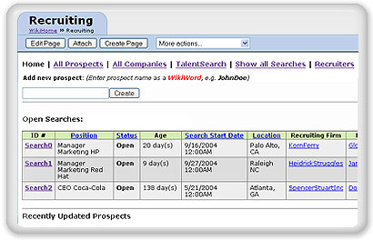

By [Christopher Allen](/lwa/about)

[Joe Kraus](http://www.jotspot.com/about/index.php), one of the co-founders of Excite, and new [blogger](http://bnoopy.typepad.com/bnoopy/) has long been [rumored](http://owt.typepad.com/blog/2004/09/wiki_and_then_s.html) to be working on a new wiki tool. Today at the [Web 2.0](http://www.web2con.com/pub/w/32/program.html) conference Joe finally unveiled [JotSpot](http://www.jotspot.com), a new type of wiki that they have named an "Application Wiki". JotSpot appears to be not only an advanced wiki, but it also moves the predominantly text-based wiki toward being able to handle structured data and web application development.

At the JotSpot website there is an page on [How JotSpot is Different](http://jot.com/compare/index.php) and an [Advanced Tour](http://jot.com/tours/advanced/1.php) of this wiki's database capabilities.

Better, however, is a demonstration that Joe Kraus and Graham Spencer gave InfoWorld reporter [Jon Udell](http://weblog.infoworld.com/udell/2004/10/06.html#a1090) an early [demo of JotSpot](http://weblog.infoworld.com/udell/gems/jot.swf), which Jon screen-captured and has released as a 23-minute, 32MB Flash presentation. This demo is very impressive: in addition to incremental improvements to wiki, such as WYSIWYG editing, email support, indexed attachments, RSS and web page importing, etc. Kraus and Spencer also demonstrate a very powerful forms templating interface that is very much like creating HTML forms with Javascript, and demonstrated integration with a [SalesForce.com](http://www.salesforce.com) web application using SOAP. It appears that JotSpot leverages the unstructured and adhoc advantages that are a strength of wiki, yet allows structure to be added later such that the data in the wiki can be integrated with other non-wiki applications.

The discussion during the demo is also very interesting. Jon Udell made an observation about JotSpot entering into Lotus Notes territory, and Kraus and Spencer discuss how JotSpot makes web application development more accessible, and expressed their desire to create a marketplace for small developers to create tools using JotSpot.

From what I've seen so far, JotSpot looks like it may the first of a third-generation of wikis, the first being the very simple wikis such as [Ward Cunningham's](http://c2.com/cgi/wiki?WardCunningham) [C2 Wiki](http://c2.com/cgi/wiki), and second generation being database-backed wikis such as [Wikipedia](http://www.wikipedia.com) and [SocialText](http://www.socialtext.com). If you are serious about wiki, I highly recommend you take a look at this demo.

Joe Kraus also announced today that they have received a $5.2M funding round from [Redpoint](http://www.redpoint.com) and [Mayfield](http://mayfield.com), both top VC firms.

More information:

* Press Release: [JotSpot Launches, Unveils Application Wiki](http://www.jotspot.com/news/jotspot_launch.php)  
    
* Article: [Business Week: Do-It-Yourself Software for All?](http://www.businessweek.com/technology/content/oct2004/tc2004106_2351.htm)  
    
* Article: [CBS MarketWatch: Excite founders unveil JotSpot](http://cbs.marketwatch.com/news/story.asp?guid=%7BFA9FE472%2DE293%2D41DC%2D9B96%2D144F34463C97%7D&siteid=mktw)  
    
* Article: [Mercury News: Palo Alto start-up enhances `Wiki' sites](http://www.mercurynews.com/mld/mercurynews/business/technology/9848041.htm)  
    
* Blog posting: [JotSpot: The Application Wiki](http://softtechvc.blogs.com/software_only/2004/10/jotspot_the_app_1.html) by Jeff Clavier  
    
* Blog posting: [Joe Kraus talks about Jotspot](http://blogs.salon.com/0000014/2004/10/06.html#a686) by Scott Rosenberg  
    
* Blog posting: [WikiWiki Warfare In The Enterprise Leading To Situational Software?](http://www.davidmattison.ca/wordpress/index.php?p=801) by David Mattison  
    
* Blog posting: [JotSpot - Lego Style Wiki?](http://socialsoftware.weblogsinc.com/entry/6448891678944212/) by Judith Meskill  
    
* Blog posting: Jot Wiki kicks ass… (Live from Web 2.0 conference in San Fran) \- by Jason Calacanis  
    
* Audio: [Audio archive of JotSpot demo at Web 2.0 Conference](http://calacanis.weblogsinc.com/common/videos/jason/jot.mp3) recorded by Jason Calacanis  
    
### Comments

An article in spanish: http://www.error500.netmodules/news/article.php?storyid=997

[Antonio](http://www.error500.net)2004-10-07T13:51:54-07:00

Hi, If you like the notion of ApplicationWikis, you should have a look at the opensource project XWiki.. It includes not only aform engine but also a programming API insidewiki pages as well as un underlying relationaldatabase.. Ludovic

[Ludovic Dubost](http://www.xwiki.org)2004-10-07T16:25:09-07:00

Thanks for the wriet up Christopher. I thinkyou asked for a beta. We're trying to provisionaccounts as rapidly as we can (while makingsure that things are scaling ok). I should beable to guarantee you get provisioned in thenext 2-3 days. If there any questions I cananswer, don't hesitate to ask.

[Joe Kraus](http://www.jot.com)2004-10-08T20:05:14-07:00

JotSpot is way behind other open source 'wikis'like TWiki and ZWiki already well into thisspace.

[Sunir](http://usemod.com/cgi-bin/mb.plSunirShah) 2004-10-14T00:42:30-07:00

[original layout]
    
<!-- [Social Software](/tags/social-software/) [User Interface](/tags/user-interface/) [Web/Tech](/tags/web/tech/) [Wiki](/tags/wiki/) [JotSpot](/tags/jotspot/) [Joe Kraus](/tags/joe-kraus/) [wiki](/tags/wiki/) [jon udell](/tags/jon-udell/) [demo](/tags/demo/) [application development](/tags/application-development/) [Javascript](/tags/javascript/) [SOAP](/tags/soap/) -->

Life With Alacrity

© Christopher Allen