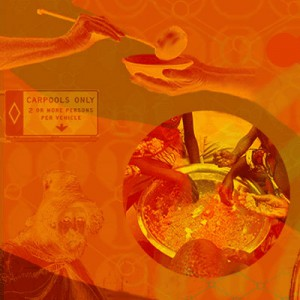

 

On the topic of the #sharingeconomy, these audio podcast and video entries from "The Really Big Questions" that ask the question "Why Do People Share" are really quite good. In particular, catch the video of Capuchin monkey's rejecting unequal pay — I've been saying for a long time that the roots of trust and fairness are in our genes.

KEYQUOTE FROM PODCAST #4: "Give and forget.

This is how one elder describes the way of life that guides the Maasai of East Africa. He speaks not of giving and getting, but of giving and letting go.

The concept is called “osotua,” and its closest English translation would be “umbilical cord.”

It means if someone doesn’t have enough, you give—up to your ability, only as much as they need and without expecting anything in return."
A blog on social software, collaboration, trust, security, privacy, and internet tools by Christopher Allen.

**“The Really Big Questions” Podcast Asks “Why Do We Share?”**

[original layout]

Life With Alacrity

© Christopher Allen